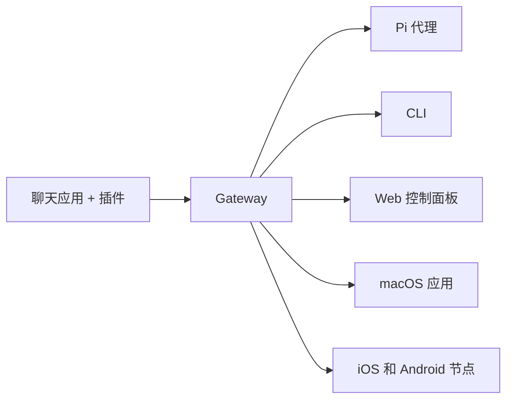

# OpenClaw 🦞

<p align="center">
    
    
</p>

> _"去角质！去角质！"_ — 大概是一只太空龙虾

<p align="center">
  <strong>适用于任何操作系统的 AI 代理多通道网关，支持 Discord、Google Chat、iMessage、Matrix、Microsoft Teams、Signal、Slack、Telegram、WhatsApp、Zalo 等平台。</strong><br />
  发一条消息，从口袋里收到代理回复。在一个 Gateway 中运行内置通道、捆绑通道插件、WebChat 和移动节点。
</p>

<Columns>
  <Card title="开始使用" href="/zh-CN/start/getting-started" icon="rocket">
    安装 OpenClaw，几分钟内启动 Gateway。
  </Card>
  <Card title="运行引导向导" href="/zh-CN/start/wizard" icon="sparkles">
    使用 `openclaw onboard` 进行引导设置和配对流程。
  </Card>
  <Card title="打开控制面板" href="/zh-CN/web/control-ui" icon="layout-dashboard">
    在浏览器中启动仪表板，进行聊天、配置和会话管理。
  </Card>
</Columns>

## 什么是 OpenClaw？

OpenClaw 是一个**自托管网关**，将你喜爱的聊天应用和通道界面——包括内置通道以及 Discord、Google Chat、iMessage、Matrix、Microsoft Teams、Signal、Slack、Telegram、WhatsApp、Zalo 等捆绑或外部通道插件——连接到 AI 编程代理（如 Pi）。你在自己的机器（或服务器）上运行一个 Gateway 进程，它就会成为你的消息应用和随时待命的 AI 助手之间的桥梁。

**适合谁？** 想要一个可以随时随地发消息的个人 AI 助手，但又不想放弃数据控制权或依赖托管服务的开发者和高级用户。

**有什么不同？**

- **自托管**：运行在你的硬件上，你的地盘你做主
- **多通道**：一个 Gateway 同时服务内置通道和捆绑/外部通道插件
- **代理原生**：专为编程代理设计，支持工具调用、会话、记忆和多代理路由
- **开源**：MIT 许可证，社区驱动

**你需要什么？** Node 24（推荐），或 Node 22 LTS（`22.16+`）兼容版本、你选择的服务提供商的 API 密钥，以及 5 分钟时间。为了最佳质量和安全性，请使用你信任的最新一代最强模型。

## 工作原理



Gateway 是会话、路由和通道连接的唯一真相源。

## 核心能力

<Columns>
  <Card title="多通道网关" icon="network" href="/zh-CN/channels">
    一个 Gateway 进程即可连接 Discord、iMessage、Signal、Slack、Telegram、WhatsApp、WebChat 等。
  </Card>
  <Card title="插件通道" icon="plug" href="/zh-CN/tools/plugin">
    捆绑插件在正式版本中添加 Matrix、Nostr、Twitch、Zalo 等支持。
  </Card>
  <Card title="多代理路由" icon="route" href="/zh-CN/concepts/multi-agent">
    按代理、工作区或发送者隔离会话。
  </Card>
  <Card title="媒体支持" icon="image" href="/zh-CN/nodes/images">
    发送和接收图片、音频和文档。
  </Card>
  <Card title="Web 控制面板" icon="monitor" href="/zh-CN/web/control-ui">
    浏览器仪表板，用于聊天、配置、会话和节点管理。
  </Card>
  <Card title="移动节点" icon="smartphone" href="/zh-CN/nodes">
    配对 iOS 和 Android 节点，支持 Canvas、相机和语音工作流。
  </Card>
</Columns>

## 快速开始

<Steps>
  <Step title="安装 OpenClaw">
    ```bash
    npm install -g openclaw@latest
    ```
  </Step>
  <Step title="引导并安装服务">
    ```bash
    openclaw onboard --install-daemon
    ```
  </Step>
  <Step title="开始聊天">
    在浏览器中打开控制面板并发送消息：

    ```bash
    openclaw dashboard
    ```

    或者连接一个通道（[Telegram](/zh-CN/channels/telegram) 最快），从手机聊天。

  </Step>
</Steps>

需要完整的安装和开发设置？查看[开始使用指南](/zh-CN/start/getting-started)。

## 控制面板

Gateway 启动后打开浏览器控制面板。

- 本地默认：[http://127.0.0.1:18789/](http://127.0.0.1:18789/)
- 远程访问：[Web 界面](/zh-CN/web) 和 [Tailscale](/zh-CN/gateway/tailscale)

<p align="center">
  
</p>

## 配置（可选）

配置文件位于 `~/.openclaw/openclaw.json`。

- 如果你**什么都不做**，OpenClaw 会使用内置的 Pi 二进制文件，以 RPC 模式运行，每个发送者独立会话。
- 如果你想锁定权限，从 `channels.whatsapp.allowFrom` 开始（对于群组）设置提及规则。

示例：

```json5
{
  channels: {
    whatsapp: {
      allowFrom: ["+15555550123"],
      groups: { "*": { requireMention: true } },
    },
  },
  messages: { groupChat: { mentionPatterns: ["@openclaw"] } },
}
```

## 从这里开始

<Columns>
  <Card title="文档中心" href="/zh-CN/start/hubs" icon="book-open">
    所有文档和指南，按使用场景分类整理。
  </Card>
  <Card title="配置" href="/zh-CN/gateway/configuration" icon="settings">
    核心 Gateway 设置、令牌和服务商配置。
  </Card>
  <Card title="远程访问" href="/zh-CN/gateway/remote" icon="globe">
    SSH 和 tailnet 访问模式。
  </Card>
  <Card title="通道" href="/zh-CN/channels/telegram" icon="message-square">
    Feishu、Microsoft Teams、WhatsApp、Telegram、Discord 等通道的具体设置。
  </Card>
  <Card title="节点" href="/zh-CN/nodes" icon="smartphone">
    iOS 和 Android 节点，支持配对、Canvas、相机和设备操作。
  </Card>
  <Card title="帮助" href="/zh-CN/help" icon="life-buoy">
    常见修复和故障排除入口。
  </Card>
</Columns>

## 了解更多

<Columns>
  <Card title="完整功能列表" href="/zh-CN/concepts/features" icon="list">
    完整的通道、路由和媒体功能。
  </Card>
  <Card title="多代理路由" href="/zh-CN/concepts/multi-agent" icon="route">
    工作区隔离和每个代理的会话。
  </Card>
  <Card title="安全" href="/zh-CN/gateway/security" icon="shield">
    令牌、允许列表和安全控制。
  </Card>
  <Card title="故障排除" href="/zh-CN/gateway/troubleshooting" icon="wrench">
    Gateway 诊断和常见错误。
  </Card>
  <Card title="关于与鸣谢" href="/zh-CN/reference/credits" icon="info">
    项目起源、贡献者和许可证。
  </Card>
</Columns>
